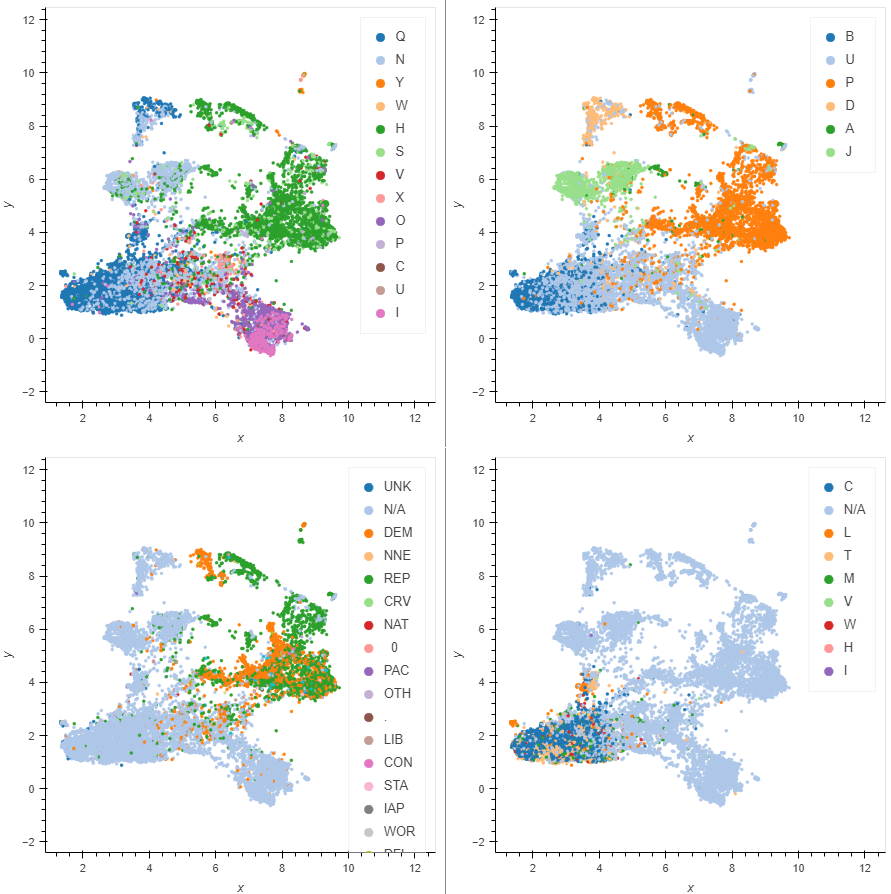

# PAC embeddings w/ denoising autoencoder

Requires data from [FEC's bulk data page](https://www.fec.gov/data/browse-data/?tab=bulk-data), expects `itoth.txt`, `cm.txt`, `cm_header_file.csv`, `oth_header_file.csv` to exist in `./data/2022`

requires `pytorch`, `pytorch-lightning`, `umap-learn`, `dask`, `fastparquet`, `scikit-learn`

* run `fecdata.py` to generate `fecpreprocd.parquet` and `meta.pkl`
* run `interpac_embedding.py` to train embeddings

Model sees `["CMTE_ID","OTHER_ID","ENTITY_TP","TRANSACTION_TP","TRANSACTION_AMT","TRANSACTION_DT"]` of `itoth.txt` (Any transaction from one committee to another), `CMTE_ID` and `OTHER_ID` are both committee IDs, and so share embeddings. The learned embeddings can separate out many of the categories given for committees in the the Committee Master file `cm.txt`:

[UMAP](https://umap-learn.readthedocs.io/en/latest/) plot of committee embeddings for all named committees, colored by `CMTE_TP`, `CMTE_DSGN`, `CMTE_PTY_AFFILIATION`, and `ORG_TP`